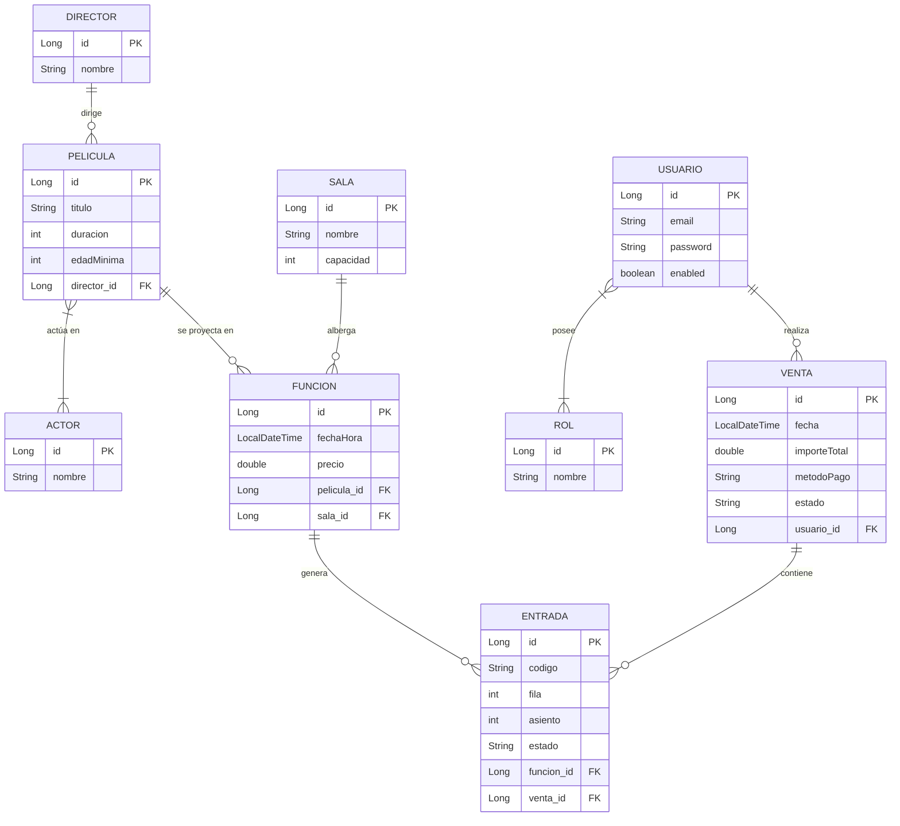

# 🎬 Cine_V2_Base - Sistema de Gestión de Entradas


Sistema integral para la gestión de cines, permitiendo la administración de películas, salas, funciones y la venta automatizada de entradas con control de disponibilidad en tiempo real.

## 🚀 Características Principales

- **Gestión de Cartelera**: Control total sobre películas, directores y repartos.
- **Programación de Funciones**: Asignación dinámica de películas a salas con horarios específicos.
- **Venta de Entradas**: Proceso de compra con validación de edad y estado de ocupación.
- **Arquitectura Robusta**: Implementación multicapa (Controller, Service, Repository, DTO).
- **Mapeo Eficiente**: Uso de MapStruct para transformaciones entre entidades y DTOs.
- **Seguridad**: Sistema de usuarios y roles integrado.

## 📊 Modelo de Datos (Diagrama E-R)

A continuación se detalla la estructura relacional del sistema:



## 🛠️ Stack Tecnológico

- **Lenguaje**: Java 21
- **Framework**: Spring Boot 4.0.2
- **Persistencia**: Spring Data JPA / Hibernate
- **Base de Datos**: PostgreSQL
- **Herramientas**:
  - **Lombok**: Para reducir el código boilerplate.
  - **MapStruct**: Mapeo profesional de entidades.
  - **Maven**: Gestión de dependencias y construcción.

## ⚙️ Configuración y Ejecución

1. **Clonar el repositorio**:
   ```bash
   git clone https://github.com/AminHarouEdu/Cine_V2_Base.git
   ```
2. **Configurar la base de datos**:
   Asegúrate de tener PostgreSQL corriendo y configurar tus credenciales en `src/main/resources/application.properties`.
3. **Ejecutar el proyecto**:
   ```bash
   ./mvnw spring-boot:run
   ```


## 📝 Tareas del Alumno

> [!IMPORTANT]
> **OBLIGATORIO**: Las siguientes tareas son fundamentales para el seguimiento del curso y deben ser completadas en los plazos indicados.

- 🚩 **[Tarea Inicial: Configuración y Primeros Pasos](Tareas/Tarea_inicial.md)**: Instrucciones para clonar, configurar el entorno y realizar el primer push.

## 📚 Lecciones y Recursos

Para facilitar el aprendizaje y las pruebas del proyecto, se han incluido los siguientes materiales:

- 📂 **[Carpeta de Lecciones](Lecciones/)**: Acceso a todo el material didáctico.
- 📖 **[Lección 1: Introducción al Proyecto Cine V2](Lecciones/Lecci%C3%B3n%201%20-%20El%20proyecto%20Cine%20V2%20-%20Introducci%C3%B3n.md)**: Explicación de la estructura base.
- 🚀 **[Colección de Postman](Lecciones/Postman_Cine_V2.json)**: Archivo para importar en Postman y realizar pruebas de la API.

---
💎 *Proyecto académico desarrollado para el módulo de Acceso a Datos (2º DAM).*
